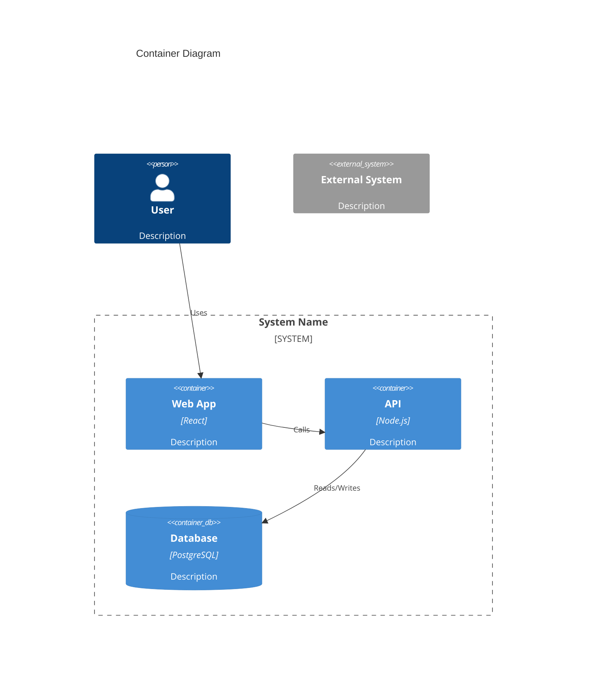

# Architecture Documentation Generator

Generate architecture documentation for: $ARGUMENTS

## Process

### 1. Discovery
- Explore project structure, configs, and existing docs
- Identify services, dependencies, and integration points
- Find existing architecture files or diagrams

### 2. Choose Output Type

Based on scope:
- **System Overview** → C4 Context + Container diagrams
- **Service Deep-Dive** → C4 Component diagram + data flow
- **Decision Documentation** → ADR

### 3. Generate Documentation

## Output Formats

### C4 Model (Mermaid)



### ADR Template

```markdown
# ADR-XXX: [Decision Title]

## Status
Proposed | Accepted | Deprecated

## Context
[Why is this decision needed?]

## Decision
[What did we decide?]

## Options Considered
1. **[Option A]**: [Pros/Cons]
2. **[Option B]**: [Pros/Cons]

## Consequences
- [What becomes easier]
- [What becomes harder]
```

### Data Flow Diagram


## File Locations

- `docs/architecture/` - C4 diagrams, system overview
- `docs/adr/` - Architecture Decision Records
- `docs/data-flow/` - Data flow documentation

## Usage

```bash
/arch-doc system              # Full system documentation
/arch-doc auth-service        # Specific service
/arch-doc "migrate to pg"     # Document a decision
```
